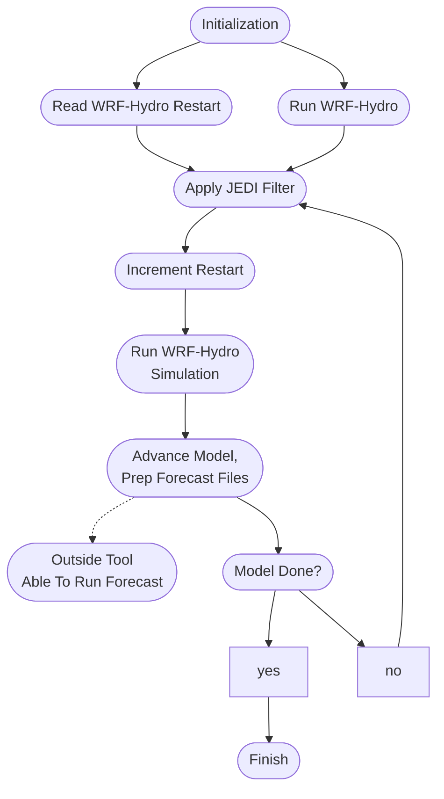

# JEDI Workflow
A framework providing a workflow between WRF-Hydro/NWM JEDI and WRF-Hydro.

# Build Steps
## JEDI Workflow Build
```console
$ mkdir build
$ cd build
$ ecbuild ../
$ make -j 4
```
The `jedi_snow_increment` executable will now be in the `build/bin` directory.
The user can choose to call `jedi_workflowpy.py` from the `build/bin`
  directory or from the `src/jedi_workflowpy` directory.


# Cheyenne Build and Run Instructions
## Setup Environment
 - Load Spack modules
```console
$ source gnu_spack_env.sh
$ cat gnu_spack_env.sh
#!/bin/bash

module purge
module unuse /glade/u/apps/ch/modulefiles/default/compilers
export MODULEPATH_ROOT=/glade/work/jedipara/cheyenne/spack-stack/modulefiles
module use /glade/work/jedipara/cheyenne/spack-stack/modulefiles/compilers
module use /glade/work/jedipara/cheyenne/spack-stack/modulefiles/misc
module load ecflow/5.8.4
module load miniconda/3.9.12
# GNU
ulimit -s unlimited
module use /glade/work/jedipara/cheyenne/spack-stack/spack-stack-v1/envs/skylab-1.0.0-gnu-10.1.0/install/modulefiles/C\
ore
module load stack-gcc/10.1.0
module load stack-openmpi/4.1.1
module load stack-python/3.9.12
module load jedi-fv3-env/1.0.0
module load bufr/11.7.1
# module load jedi-ewok-env/1.0.0
# module load nco/5.0.6

# these are needed so WRF-Hydro can build without other modifications
export NETCDF_INC=${netcdf_fortran_ROOT}/include
export NETCDF_LIB=${netcdf_fortran_ROOT}/lib
```
 - Create Python environment to get wrfhydropy package
```console
$ python3 -m venv ~/[local_path]/env
$ activate ~/[local_path]/env
$ python3 -m pip install wrfhydropy
```

## Obtain Source Code
 - Clone repositories
```console
$ git clone git@github.com:JCSDA-internal/wrf_hydro_nwm_jedi.git
$ git clone git@github.com:NCAR/wrf_hydro_nwm_public.git
$ git clone git@github.com:NCAR/jedi_workflow.git
```

## Build Source Code
- Build WRF-Hydro/NWM:
 The Python project wrfhydropy will automatically build this.

- Build WRF-Hydro/NWM JEDI
```console
$ cd wrf_hydro_nwm_jedi
$ mkdir build
$ cd build
$ ecbuild ../bundle
$ make -j 4
```

- Build JEDI Workflow
```console
$ cd wrf_hydro_nwm_jedi
$ mkdir build
$ ecbuild ..
$ make -j 4
```

## Setup Yaml Files
More to be added to this section.

## Run Workflow
```console
$ python3 [path_to]/jedi_workflowpy.py jedi_workflow.yaml
```


<!-- # Running -->
<!-- ## Prerequisites -->
<!--  - Python 3 and [wrf_hydro_py](https://github.com/NCAR/wrf_hydro_py) -->
<!--  - [WRF-Hydro/NWM JEDI](https://github.com/JCSDA-internal/wrf_hydro_nwm_jedi) -->
<!--  - [WRF-Hydro](https://github.com/NCAR/wrf_hydro_nwm_public) -->
<!--  - Prepare Experiment Configuration Files -->
<!--    - jedi_workflow.yaml -->
<!--    - jedi.yaml -->
<!--    - WRF-Hydro namelists, to be placed in the WRF-Hydro domain directory -->
<!-- 	 - hrldas_namelists.json -->
<!--      - hydro_namelists.json -->

<!-- ### Prepping YAMLs -->
<!--  - The starting time in `jedi.yaml` is propagated to JEDI and WRF-Hydro YAMLs -->
<!-- during the initilization phase and while the model runs. -->
<!--  - More to be added -->


# Basic JEDI Workflow workflow




# Miscellaneous Information
## WRF-Hydro Spack Modules Build Instructions


## Note
The member directories that are created by wrfhydropy have restart files that
aren't used and may not correspond with the actuals files being used.
The yamls point to the real files being used and those reside in the top
directory, named after the project name.

## YAMLs
JEDI Workflow YAML: if the `start_wrf-h_time` and `start_jedi_time` time are
equal, then WRF-Hydro is not run before starting the cycle, only a restart
file is used.

## Debugging
If the program fails while running `wrf_hydro_py`, examine the `foo.stdout`
and `foo.stderr` files in the member subdirectories.

If the program fails or is stopped during the `wrf_hydro_py`, WRF-Hydro may
need to be recompiled.


# Add JEDI increment data to WRF-Hydro data
## Description
Code is based on the [project AddJediIncr](https://github.com/ClaraDraper-NOAA/AddJediIncr) by Clara Draper and Mike Barlage.

Increment JEDI adds analysis to WRF-Hydro restart files.
Used in conjunction with [WRF-Hydro/NWM JEDI Implementation](https://github.com/JCSDA-internal/wrf_hydro_nwm_jedi).
