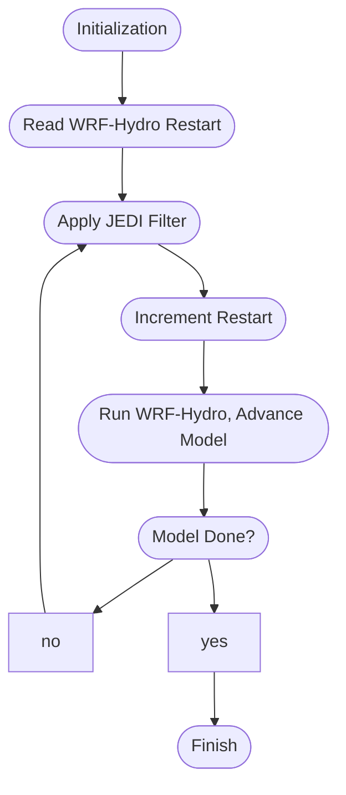

# JEDI Workflow
A framework providing a workflow between WRF-Hydro/NWM JEDI and WRF-Hydro.

## Prerequisites
 - Python 3 and [wrf_hydro_py](https://github.com/NCAR/wrf_hydro_py)
 - [WRF-Hydro/NWM JEDI](https://github.com/JCSDA-internal/wrf_hydro_nwm_jedi)
 - [Add JEDI Increment](https://github.com/scrasmussen/add_jedi_increment)
 - [WRF-Hydro](https://github.com/NCAR/wrf_hydro_nwm_public)
 - Prepare Experiment Configuration Files
   - jedi_workflow.yaml
   - jedi.yaml
   - WRF-Hydro namelists, to be placed in the WRF-Hydro domain directory
	 - hrldas_namelists.json
     - hydro_namelists.json

## Running
`$ python3 jedi_workflowpy.py jedi_workflow.yaml`

# Basic JEDI Workflow workflow

# Debugging
If failure happens while running `wrf_hydro_py`, examine the `foo.stdout` and
`foo.stderr` files in the member subdirectories.
