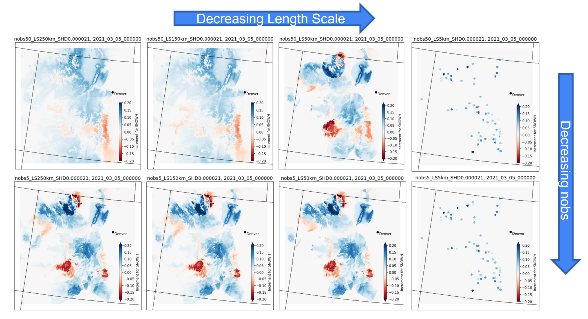

# DA Method YAML Files

A relevant documentation of the JEDI configuration yaml file and its details can be found at [https://land-da.readthedocs.io/en/v1.0.0/index.html](https://land-da.readthedocs.io/en/v1.0.0/index.html)

We are going to explore and explain the `LETKF-OI` .yaml file as part of this documentation. Our workflow testcase set contains two files `letkf_oi_09253000_SWE.yaml` and `letkf_oi_09253000_SNOWH.yaml` for two separate experiments assimilating SWE and Snow Height (i.e., snow depth) observations over the river basin LITTLE SNAKE RIVER NEAR SLATER in CO, USGS `09253000`.


Below is an overall structure of the `letkf_oi_09253000_SNOWH.yaml` file from the workflow testcases.
```
window begin: &date '2021-03-01T00:00:00Z'
window length: PT24H

geometry:
  input_file: /path/to/geometry/file e.g. /site_09253000/Domain/geometry_nwm_long_range.nc

background:
  members:
    - date: 2021-03-01T00:00:00Z
      read_from_file: 1
      filename_lsm: ./RESTART.2021030100_DOMAIN1_mem001
      filename_hydro: ./HYDRO_RST.2021-03-01_00:00_DOMAIN1
      state variables: ['SNOWH']
    - date: 2021-03-01T00:00:00Z
      read_from_file: 1
      filename_lsm: ./RESTART.2021030100_DOMAIN1_mem002
      filename_hydro: ./HYDRO_RST.2021-03-01_00:00_DOMAIN1
      state variables: ['SNOWH']  

observations:
  observers:
  - obs space:
      name: 'Simulate'
      distribution:
        name: InefficientDistribution
      simulated variables: ['snow_depth']
      obsdatain:
        obsfile: '/path/to/the/first/obs/file/ e.g. /site_09253000/SNOTEL_obs/owp_depth_2021-03-01T00:00:00Z.nc'
      obsdataout:
        obsfile: 'jedi_letkf_out_obs_depth_2021-03-01T00:00:00Z.nc'
    obs operator:
        name: 'Identity'    
    obs error:
        covariance model: 'diagonal'
    obs localizations:
    - localization method: Horizontal SOAR
      lengthscale: 250e3
      soar horizontal decay: 2.1e-02
      max nobs: 50
    - localization method: Vertical Brasnett
      vertical lengthscale: 500  
    obs filters:
    - filter: Bounds Check # negative / missing snow
      filter variables:
      - name: snow_depth
      minvalue: 0
    - filter: Bounds Check # negative / missing snow
      filter variables:
      - name: snow_depth
      maxvalue: 999999.0
    # - filter: Background Check # gross error check
    #   filter variables:
    #   - name: snow_depth
    #   threshold: 12.0
    #   action:
    #     name: reject
    - filter: Domain Check
      where:
      - variable: 
          name: latitude@MetaData
        minvalue: 40.5
        maxvalue: 41.5
    - filter: Domain Check
      where:
      - variable: 
          name: longitude@MetaData
        minvalue: -107.5 
        maxvalue: -106.5
                 

driver:
  save posterior mean: true
  save posterior ensemble: false
  save posterior mean increment: true

local ensemble DA:
  solver: LETKF
  inflation:
    rtps: 0.0
    rtpp: 0.0
    mult: 1.0

output:
  datadir: '.'
  date: *date
  exp: letkf
  type: 'ens'

output increment:
  datadir: '.'
  date: *date
  exp: letkf_inc
  type: 'ens'

```

## Geometry File
One of the first steps in creating a new study domain is to create a geometry file for your runs. 
The script provided at `bundle/wrf_hydro_nwm_jedi/preprocess/geometry_preprocess.py` is a tool to be used for creating the geometry file for a new application.
The `geometry` key in the `letkf_oi.yaml` file should specify the path to the geometry file.

```
geometry:
  input_file: /path/to/geometry/file e.g. /site_09253000/Domain/geometry_nwm_long_range.nc
```
## Localication Parameters
This section specifies the observation localization method and parameters. It basically controls the degree of which nearby observations have influence on the DA at a forecast grid cell. 
```  
  - localization method: Horizontal SOAR
      lengthscale: 250e3
      soar horizontal decay: 2.1e-02
      max nobs: 50
    - localization method: Vertical Brasnett
      vertical lengthscale: 500
```

- `localization method` determines the observation localization method. Valid values include: `Horizontal SOAR` and `Vertical Brasnett`
  - `Horizontal SOAR`	is the Second Order Auto-Regressive localization in the horizontal 2-D axes.
    - `lengthscale` specifies the radius of DA influence. In another word, it is the maximum distance of observations from the forecast location. The unit is meters, and the suggested format is e-notation.
    - `soar horizontal decay` is the decay scale of the SOAR localization method. Basically, it determines how fast the influence of DA decay as a function of distance between observation site and the forecast location. 
    - `max nobs` can limit the maximum number of nearby observations being used to update a given forecast point.
  - `Vertical Brasnett` is the vertical component of the localization algorithm for snow DA applications. See `Brasnett 1999` [https://doi.org/10.1175/1520-0450(1999)](https://doi.org/10.1175/1520-0450(1999)038%3C0726:AGAOSD%3E2.0.CO;2) for details.

Figure below shows how each parameter changes the DA impact on the target variable `SNOWH` within the posterior restart files of WRF-Hydro model.

## Control Observation Data
Also the parameters below can be used in filtering missing/bad observation values and masking observation points outside the region of interest.
```
    obs filters:
    - filter: Bounds Check # negative / missing snow
      filter variables:
      - name: snow_water_equivalent
      minvalue: 0
    - filter: Bounds Check # negative / missing snow
      filter variables:
      - name: snow_water_equivalent
      maxvalue: 999999.0
    # - filter: Background Check # gross error check
    #   filter variables:
    #   - name: snow_depth
    #   threshold: 12.0
    #   action:
    #     name: reject
    - filter: Domain Check
      where:
      - variable:
          name: latitude@MetaData
        minvalue: 40.5
        maxvalue: 41.5
    - filter: Domain Check
      where:
      - variable:
          name: longitude@MetaData
        minvalue: -107.5
        maxvalue: -106.5

```